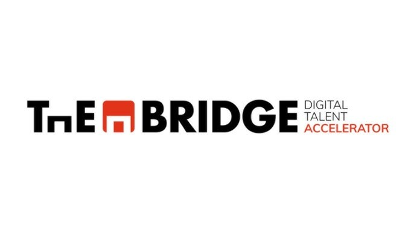

# 🚢 Hundir la Flota 

> **Selecciona tu idioma / Select your language:**
> 
> [🇪🇸 Leer en Español](#español) | [🇺🇸 Read in English](#english)

---

<a name="español"></a>


### 🇪🇸 Descripción en Español


## 🚢 Hundir la Flota 

Este proyecto implementa una versión digital del clásico juego **Hundir la Flota**, desarrollado en Python como parte del **Bootcamp de Data Science de The Bridge**.

El objetivo es simular un entorno de juego completo por turnos, aplicando principios de programación estructurada, diseño modular y metodología Agile.


## 🎮 Descripción del Sistema
El sistema reproduce una partida entre un usuario y una IA con comportamiento aleatoria. El flujo gestiona impactos, fallos y condiciones de victoria actualizando matrices en tiempo real.


## 🌍 Internacionalización 
El juego permite seleccionar el idioma al inicio:
* ES **Español**
* 🇺🇸 **English**


## 🧠 Lógica y Stack Tecnológico
El proyecto se apoya en herramientas fundamentales del ecosistema de Data Science:

* **Lenguaje:** Python 3.x
* **Librerías:** * `NumPy`: Gestión de tableros mediante matrices bidimensionales.
    * `Random`: Lógica de posicionamiento y disparos aleatorios.
* **Metodología:** Agile / Scrum con control de versiones en Git & GitHub.


## 📐 Arquitectura del Proyecto
El código sigue una estructura modular para facilitar el mantenimiento y la escalabilidad:

| Archivo | Responsabilidad |
| :--- | :--- |
| `main.py` | Orquestación del flujo y bucle principal del juego. |
| `clases.py` | Abstracción del tablero mediante POO (Clases `Board` y `Ships`). |
| `funciones.py` | Lógica del juego (disparos, colocación y validaciones). |
| `variables.py` | Configuración global, diccionarios y coordenadas. |


## 🎯 Simbología del Tablero
El tablero utiliza los siguientes símbolos para representar visualmente el estado de la partida:

| Símbolo | Significado |
| :--- | :--- |
| `~` | Agua / Casilla vacía |
| `S` | Posición de barco |
| `X` | Impacto acertado |
| `O` | Disparo fallido |


## 👥 Equipo de Desarrollo
El éxito de este proyecto se basa en la colaboración distribuida y roles definidos:

* **Ana Belén Balmaseda** — *Scrum Master * 
(`variables.py`)
    * Coordinación de equipo, gestión de backlog y definicion de los parámetros, símbolos y textos para garantizar un código organizado, escalable y bilingüe
* **Dani García** — *Dev 1* (`clases.py`)
    * Diseño de la capa de objetos y estado del tablero.
* **Inés Goetsch** — *Dev 2* (`funciones.py`)
    * Mecánicas de juego y validación de lógica funcional.
* **Pablo Hernández** — *Dev 3* (`main.py`)
    * Ciclo de vida de la partida y flujo principal.
* **Maksym Chaika** — *Soporte Tecnico*
    * Optimización de código y resolución de incidencias.


## 🚀 Instalación y ejecución

Clona el repositorio:
```bash
git clone https://github.com/tu-usuario/Hundir_la_flota.git
```

Entra en el directorio:
```bash
cd Hundir_la_flota
```

Instala las dependencias (si aplica):
```bash
pip install -r requirements.txt
```

Ejecuta el juego:
```bash
python main.py
```


**📅 Fecha:** Abril/ 2026  
**📍 Ubicación:** España 


<p align="center">
  
</p>


 -----------------------------------------


<a name="english"></a>


# 🚢 Battleship Game

### 🇺🇸 English Version


## 🚢 Battleship:

This project implements a digital version of the classic game Battleship, developed in Python as part of the Data Science Bootcamp at The Bridge.

The goal is to simulate a full turn-based game environment, applying structured programming principles, modular design, and Agile methodology.


## 🎮 System Description

The system simulates a match between a user and an AI with random behavior.
The flow handles hits, misses, and win conditions while updating boards in real time.


## 🌍 Internationalization 

The game allows language selection at the start:

* ES **Español**
* 🇺🇸 **English**


## 🧠 Logic and Tech Stack
The project is built on fundamental tools from the Data Science ecosystem:

* **Language:** Python 3.x
* **Libraries:**  
    * `NumPy`: Board management using two-dimensional arrays.  
    * `Random`: Logic for random ship placement and shooting.  
* **Methodology:** Agile / Scrum with version control using Git & GitHub.  


## 📐 Project Architecture
The code follows a modular structure to facilitate maintenance and scalability:

| File | Responsibility |
| :--- | :--- |
| `main.py` | Orchestration of the flow and main game loop. |
| `clases.py` | Board abstraction using OOP (Classes `Board` and `Ships`). |
| `funciones.py` | Game logic (shooting, placement, and validations). |
| `variables.py` | Global configuration, dictionaries, and coordinates. |


## 🎯 Board Symbol Legend
The board uses the following symbols to visually represent the game state:

| Symbol | Meaning |
| :--- | :--- |
| `~` | Water / Empty cell |
| `S` | Ship position |
| `X` | Successful hit |
| `O` | Missed shot |


## 👥 Development Team
The success of this project is based on distributed collaboration and clearly defined roles:

* **Ana Belén Balmaseda** — *Scrum Master* (`variables.py`)  
    * Team coordination, backlog management, and definition of parameters, symbols, and texts to ensure organized, scalable, and bilingual code.  

* **Dani García** — *Dev 1* (`clases.py`)  
    * Design of the object layer and board state.  

* **Inés Goetsch** — *Dev 2* (`funciones.py`)  
    * Game mechanics and functional logic validation.  

* **Pablo Hernández** — *Dev 3* (`main.py`)  
    * Game lifecycle and main flow.  

* **Maksym Chaika** — *Technical Support*  
    * Code optimization and issue resolution.  


## 🚀 Installation and Execution

Clone the repository:
```bash
git clone https://github.com/tu-usuario/Hundir_la_flota.git
```

Enter the directory:
```bash
cd Hundir_la_flota
```

Install dependencies (if applicable):
```bash
pip install -r requirements.txt
```

Run the game:
```bash
python main.py
```


**📅 Date:** April 2026  
**📍 Location:** Spain  

<p align="center">
  
</p>
